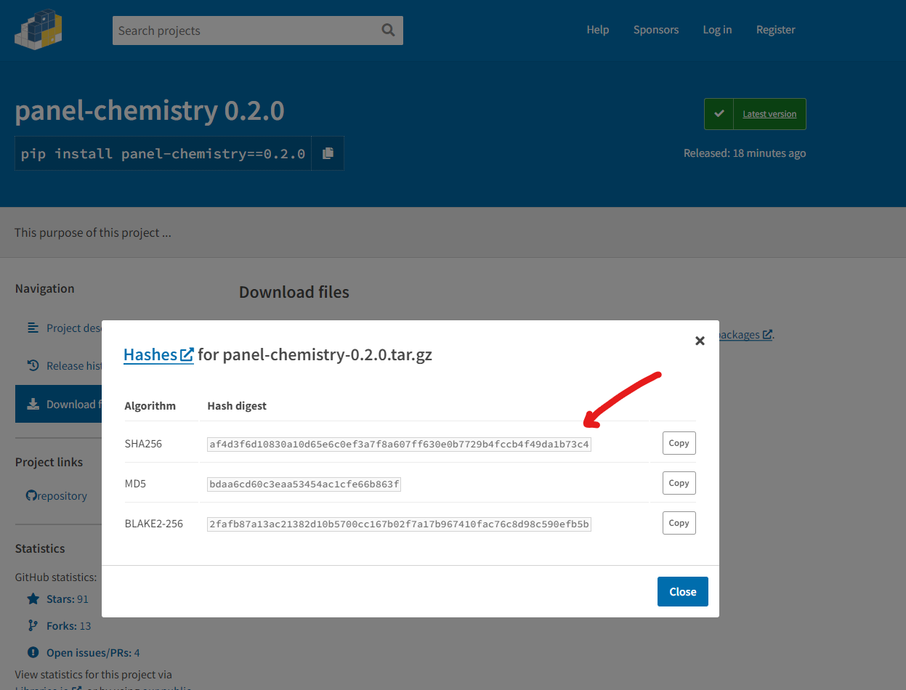

# ❤️ Developer Guide

Welcome. We are so happy that you want to contribute.

## 🧳 Prerequisites

- A `conda` environment.
- [Git CLI](https://git-scm.com/book/en/v2/Getting-Started-Installing-Git).

You can also use `pip` if you can get `node.js` installed.

## 📙 How to

Below we describe how to install and use this project for development.

### 💻 Install for Development

To install for development you will need to create and activate a virtual environment

```bash
conda create --name panel-chemistry python=3.9 nodejs
conda activate panel-chemistry
```

Then run

```bash
git clone https://github.com/awesome-panel/panel-chemistry.git
cd panel-chemistry
pip install pip -U
pip install -e .[all]
```

This will install the
[`awesome-panel-cli`](https://github.com/awesome-panel/awesome-panel-cli). You can see the available commands via

```bash
pn --help
```

You can run all tests via

```bash
pn test all
```

Please always run this command and fix any failing tests if possible before you `git push`.

### Build the Bokeh models

```bash
panel build src/panel_chemistry
```

### 🚢 Release a new package on Pypi

Please make sure you have upgraded bokeh

```bash
cd src/panel_chemistry
npm update @bokeh/bokehjs --save
npm audit fix
cd ../..
```

Update the version number in the [__init__.py](src/panel_chemistry/__init__.py) and
[package.json](src/panel_chemistry/package.json) files.

Then run

```bash
pn test all
```

Then you can build

```bash
panel build src/panel_chemistry
pn build package
```

and upload

```bash
pn release package <VERSION>
```

to release the package 📦. To upload to *Test Pypi* first, you can add the `--test` flag.

### Release the package to conda-forge

Follow [Conda | example workflow for updating a package](https://conda-forge.org/docs/maintainer/updating_pkgs.html#example-workflow-for-updating-a-package) for the [`panel-chemistry-feedstock`](https://github.com/conda-forge/panel-chemistry-feedstock).

Remember to

```bash
conda install -c conda-forge conda-smithy
conda smithy rerender -c auto
```

Remember to update the SHA! You can find it on Pypi


